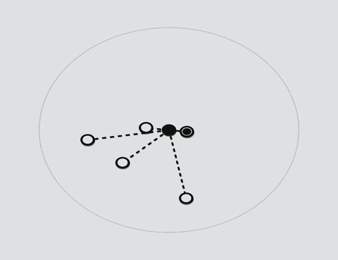
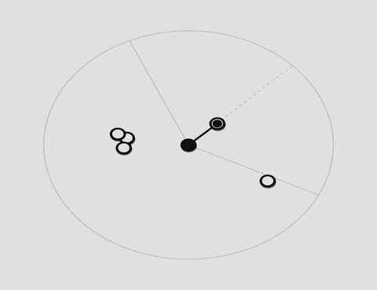

# Flex Targeting
A light-weight, flexible, **allocation-free** set of methods for finding the best target from a list of input targets.
- Builtin targeting solutions for the most common target finding scenarios
- Generic interfaces provide flexibility in building custom targeting solutions
- Multiple stages of filtering to optimize the selection of targets
- Strong focus on an allocation free implementation and supporting custom allocation free solutions
- Builtin repository for all custom types of targets for ease of use
- Line of sight handling with opt-out options
## Usage
### DetermineBestTarget(s)
There are 2 core methods: The first method and it's overloads return a single best target:
```csharp
using Cyclic.FlexTargeting;

// The most basic core method simply outputs the best target based on your provided data.
FlexTargetingCore.DetermineBestTarget(data, out CustomTarget bestTarget);


// The method returns true if a target was found. Useful if you don't want to check for null.
bool wasTargetFound = FlexTargetingCore.DetermineBestTarget(data, out CustomTarget bestTarget);


// You can also pass in a custom filter delegate for more fine grained filtering.
FlexTargetingCore.DetermineBestTarget(data, out CustomTarget bestTarget,
    (target) => target != GetSpecialTargetToIgnore());

// However, the previous implementation would implicitly capture "this"!
// So pass in a context object to avoid an allocation cost.
// (see the "Advanced Topics" of the README for more info)
FlexTargetingCore.DetermineBestTarget(context: this, data, out CustomTarget bestTarget,
    (context, target) => target != context.GetSpecialTargetToIgnore());


// If you don't specify an input list, the builtin repository will be queried.
// Alternatively, you can provide your own input list
List<CustomTarget> inputList = ProvideMyOwnInputList();
FlexTargetingCore.DetermineBestTarget(data, out CustomTarget bestTarget, inputList)
```

The second core method and it's overloads return a list of all targets that pass every condition, sorted from best to worst.
```csharp
using Cyclic.FlexTargeting;
List<CustomTarget> bestTargets = new();

// Outputs the best targets into the provided container.
FlexTargetingCore.DetermineBestTargets(data, bestTargets);


// The method returns the amount of targets that were output into your container.
int numBestTargets = FlexTargetingCore.DetermineBestTargets(data, bestTargets);


// You can also pass in a custom filter.
// WARNING: implicit capture of "this"
FlexTargetingCore.DetermineBestTargets(data, bestTargets,
    (target) => target != GetSpecialTargetToIgnore());

// But make sure you are being careful about unnecessary allocations.
// OK: does not implicitly capture "this"
FlexTargetingCore.DetermineBestTargets(context: this, data, bestTargets,
    (context, target) => target != context.GetSpecialTargetToIgnore());


// And you can still specify your own input list.
List<CustomTarget> inputList = ProvideMyOwnInputList();
FlexTargetingCore.DetermineBestTargets(data, bestTargets, inputList);
```
### IFlexData
The core methods will find the best target based on the data that is passed to it. Data must implement the `IFlexData<TTarget>` interface. This interface is generic, where `TTarget` can be `IFlexTarget` so that it can be compatible with any implementation of `IFlexTarget`. Or, `TTarget` can be a specific implementation of `IFlexTarget` for more specific use cases.

```csharp
public interface IFlexData<in TTarget> where TTarget : IFlexTarget
{
    Vector3 TargeterPosition { get; }
    float MaxRange { get; }
    float LosRaySize => 0.0f;
    float LosBufferRadius => 0.0f;
    LayerMask LosLayerMask { get; }
    QueryTriggerInteraction LosQueryTriggerInteraction => QueryTriggerInteraction.Ignore;
    Comparison<FlexTargetListItem> ScoreComparer => FlexTargetingExtras.SortBySmallestScore;

    bool DoesPassFilter(TTarget target);
    bool ScoreTarget(TTarget target, out float score);
}
```

The interface has some default implementations for the properties/methods that aren't commonly overridden. But of course, they can be overridden at any time.

The heart of the core targeting methods is the scoring functions that determine the best target. This scoring function is defined in the data that is passed into the core methods. I sometimes like to refer to these objects that implement `IFlexData` as targeting solutions.

This package contains 2 common targeting solutions for convenience: [RangeTargetingData](https://github.com/c-licona/FlexTargeting-Unity/blob/dev/Runtime/Builtin/RangeTargetingData.cs) and [DirectionTargetingData](https://github.com/c-licona/FlexTargeting-Unity/blob/dev/Runtime/Builtin/DirectionTargetingData.cs). It also contains one more implementation which can be useful in certain cases but also acts as a good example of a slightly more complex solution: [ComboTargetingData](https://github.com/c-licona/FlexTargeting-Unity/blob/dev/Runtime/Builtin/ComboTargetingData.cs).

Here is the scoring function for [RangeTargetingData](https://github.com/c-licona/FlexTargeting-Unity/blob/9a989b53b208886e95e84b399257b1c551aa429e/Runtime/Builtin/RangeTargetingData.cs#L54):

```csharp
public virtual bool ScoreTarget(IFlexTarget target, out float score)
{
    score = Vector3.Distance(TargeterPosition, target.TargetPosition);
    return score <= MaxRange;
}
```


The `RangeTargetingData` is a very simple targeting solution that simply determines the closest target as the "best" target. This scoring function takes the distance between the targeter and the target, and uses that distance value as the score. This score value is then used by the targeting methods to sort the targets and output the target that had the lowest score value (smallest distance). Additionally, this `ScoreTarget` method returns a boolean value that can be used to cull/filter out any targets that have "invalid" scores.

Let's look at a slightly more complex scoring function from [DirectionTargetingData](https://github.com/c-licona/FlexTargeting-Unity/blob/dev/Runtime/Builtin/DirectionTargetingData.cs):
```csharp
public virtual bool ScoreTarget(IFlexTarget target, out float score)
{
    Vector3 oPos = TargeterPosition;
    Vector3 oForward = TargeterDirection;
    Vector3 targetPos = target.TargetPosition;

    score = Vector3.Angle(targetPos - oPos, oForward);
    return score <= HalfAngle;
}
```


The `DirectionTargetingData` solution determines the "best" target by taking the angle between 2 vectors: the targeter's "forward" direction, and the vector from the targeter to the target. The angle value is then used as the score. (A practical example of this would be to use the player camera as the targeter. Then the best target would be the target that is closest to the center of the player camera view). Since `Vector3.Angle` only ever returns a value between 0 and 180, then that is the total range the score can possibly be. The [ComboTargetingData](https://github.com/c-licona/FlexTargeting-Unity/blob/dev/Runtime/Builtin/ComboTargetingData.cs) solution actually takes advantage of this fact in its more complex scoring function.

Another important method to implement for `IFlexData` is the `DoesPassFilter` method. Here is the [default implementation](https://github.com/c-licona/FlexTargeting-Unity/blob/9a989b53b208886e95e84b399257b1c551aa429e/Runtime/IFlexData.cs#L95) for this interface method:
```csharp
bool DoesPassFilter(TTarget target)
{
    return Vector3.Distance(TargeterPosition, target.TargetPosition) <= MaxRange
           && target.IsTargetValid;
}
```

This method is the first line of defense when it comes to filtering out targets in the core targeting methods. This default implementation will filter out any targets that are outside of the max range, as well as targets that are reporting themselves as "invalid." The `DirectionTargetingData` solution uses this default implementation, so if you put everything together then that solution will only return targets that are within range, that are valid, and that are within the defined `HalfAngle`.
### IFlexTarget
Targets can be any class as long as it implements the `IFlexTarget` interface:
```csharp
public interface IFlexTarget {
    bool IsTargetValid { get; }
    Vector3 TargetPosition { get; }
    float LosBufferRadius { get; }
}
```

The most common situation is to create a new MonoBehavior script that implements the interface and gets attached the the game object that is your target.
- `IsTargetValid` can be used to optionally filter out your target based on certain conditions
- `TargetPosition` would return the current position of the target the script is attached to
- `LosBufferRadius` can be used to create a buffer around the target at which line-of-sight checks should end early so that they don't collide with the target itself and falsely cause the LOS check to fail

In most typical situations, targets should be registered to the target repository so that the core targeting methods can be used without explicitly passing in a list of targets. For example:
```csharp
void OnEnable() {
    FlexTargetRepository.AddTarget(this);
}

void OnDisable() {
    FlexTargetRepository.RemoveTarget(this);
}
```

This will make the target findable by core targeting methods only when it is enabled. A helpful abstract class is provided that can be derived from in order to automatically handle this registration for MonoBehavior's called: [FlexTargetComponent](https://github.com/c-licona/FlexTargeting-Unity/blob/main/Runtime/FlexTargetComponent.cs). However, registration is easy enough that this component really isn't necessary, just don't forget to register your target!
### Line-of-sight
Line-of-sight checks are part of the core targeting functionality and there are plenty of settings to tune it as part of the `IFlexData` interface (including opting out of line-of-sight checks entirely if they are not needed).

On the targeter side, LOS settings include:
- `LosRaySize`
- `LosBufferRadius`
- `LosLayerMask`
- `LosQueryTriggerInteraction`

On the target side, LOS settings include:
- `LosBufferRadius`

`LosRaySize` allows you to easily change between using a normal raycast or a sphere cast depending on the size value you provide.

`LosBufferRadius` is found on both the targeter and target. This value essentially offsets the line-of-sight ray so that it can start a certain distance away from the actual position of the targeter or target. This can be useful if for example there are colliders around your target, and you want to make sure that the line-of-sight check stops before it intersects with the targets own colliders.

`LosLayerMask` defines which physics layers will block the line-of-sight raycast. Set this to "Nothing" to ignore line-of-sight altogether.
## Installation

| Method        |                                                                                                                                                                                                                                                                                                                                                             |
| ------------- | ----------------------------------------------------------------------------------------------------------------------------------------------------------------------------------------------------------------------------------------------------------------------------------------------------------------------------------------------------------- |
| Local tarball | Every [release](https://github.com/c-licona/FlexTargeting-Unity/releases) comes with a tarball file that I have generated and [signed with the Unity Package Manager](https://docs.unity3d.com/Manual/cus-export.html). <br><br>See this Unity documentation for more info on installing tarball files: https://docs.unity3d.com/Manual/upm-ui-tarball.html |
| Local folder  | If you download the source code, you can install the package from a local folder. <br><br>See this Unity documentation for more info on installing from a local folder: https://docs.unity3d.com/Manual/upm-ui-local.html                                                                                                                                   |
| Git URL       | You can install the package via the git URL.<br>Current: `https://github.com/c-licona/FlexTargeting-Unity.git#current`<br>Specific version example: `https://github.com/c-licona/FlexTargeting-Unity.git#v0.4.0`<br><br>See this Unity documentation for more info on installing via Git URL: https://docs.unity3d.com/Manual/upm-ui-giturl.html            |

## Requirements
This package was developed starting in Unity 6000.3.3f1, however it is likely compatible with much earlier versions of Unity. Currently it does not have a strict minimum required version.

However, this package does make use of C# interface default implementations. This feature appears to have been introduced in Unity 2021.2 with `.NET Standard 2.1`. I haven't checked myself but that may be the actual minimum required version.
## Known limitations
The core targeting methods take input targets as a `IReadOnlyList` instead of as an `IEnumerable`. This is an intentional design choice in order to avoid allocations when iterating through the input list using `IEnumerable` and a foreach loop. See this article for more information: https://pikhota.com/posts/unity-foreach/
## Package contents

```
Runtime/
├─ Builtin/             <-- [1]
├─ BuiltinRepository/   <-- [2]
├─ Highlight/           <-- [3]
└─ ...                  <-- [4]
Tests/                  <-- [5]
Documentation~/
CHANGELOG.md
LICENSE.md
README.md
package.json
```

1. Builtin targeting solutions: RangeTargeting, DirectionTargeting, and ComboTargeting
2. The builtin target repository that is used by default
3. Some optional interfaces for getting started highlighting targets
4. The core scripts for flex targeting
5. Tests to verify functionality using the Unity Test Framework
## Document revision history

| Date       | Description                                                                                                                                       |
| ---------- | ------------------------------------------------------------------------------------------------------------------------------------------------- |
| 2026-04-03 | Added gifs for range and direction targeting examples                                                                                             |
| 2026-03-12 | Added new sections: Usage, Installation, Requirements, Known limitations, Package contents, Document revision history, Advanced topics, Reference |
| 2026-01-30 | Added a new basic description                                                                                                                     |
| 2026-01-18 | Initial README                                                                                                                                    |

## Advanced topics
### Allocation free targeting
Technically there should be an asterisk appended to "allocation-free". You should be aware of the situations that can cause allocations.

First, there will always be an upfront allocation cost for cases such as:
- Initialization of static variables
- First time caching of lambdas
- if you're using the builtin target repositories: lazy loading of a new internal list for each type of target, the first time that type of target is registered or searched for

While these are unavoidable, there are situations that are avoidable. The `TargetFilter` is a delegate which means that if you're not careful then you may cause allocations for every core method call!

In this example we are searching for the best target every frame and doing something with it. There is a specific target that we want to exclude from the target search called `targetToIgnore`. We use a custom `Filter` method that we pass into the `DetermineBestTarget` method.
```csharp
class TargetingExample {
    public CustomTarget targetToIgnore; // assigned in editor
    public TargetingData data;

    bool Filter(CustomTarget target) {
        return target != targetToIgnore; // accept every target except the one to ignore
    }

    void Update() {
        FlexTargetingCore.DetermineBestTarget(data, out CustomTarget bestTarget, Filter);
        // do something with the returned bestTarget
    }
}
```
> [!warning]
> This example allocates every frame!
>
> We are passing in the instance method "Filter" which implicitly captures `this` and allocates every time the `DetermineBestTarget` method is called.

Now let's fix the previous example so that we no longer allocate every frame:
```csharp
class TargetingExample {
    public CustomTarget targetToIgnore; // assigned in editor
    public TargetingData data;

    bool Filter(CustomTarget target) {
        return target != targetToIgnore; // accept every target except the one to ignore
    }

    void Update() {
        FlexTargetingCore.DetermineBestTarget(context: this, data,
            out CustomTarget bestTarget,
            (context, target) => context.Filter(target) );
        // do something with the returned bestTarget
    }
}
```
> [!note]
> This example does NOT allocate every frame!
>
> We use a lambda and the method overload of `DetermineBestTarget` that accepts a context object. Through this context object we can access the same "Filter" method from before without allocating every frame.

Check out these resources for more information:
- [PrimeTween - Zero allocations with delegates](https://github.com/KyryloKuzyk/PrimeTween?tab=readme-ov-file#zero-allocations-with-delegates)
- [Delegates and Garbage Creation](https://www.jacksondunstan.com/articles/3765)
- [Zero allocation code in Unity](https://www.sebaslab.com/zero-allocation-code-in-unity/)
- [Delegates, Events, and Closures in Unity — Finally Explained](https://www.youtube.com/watch?v=za91AjX-V7M)
- [Fix Closure Issues in 10 Minutes and Boost Performance](https://www.youtube.com/watch?v=xiz24OqwEVI)

### Target Repository Replacement
The provided builtin target repository can be swapped out with your own implementation if you wish.

Repository methods are accessed through the `Cyclic.FlexTargeting.FlexTargetRepository`  static class. This class has 3 primary methods that are commonly used throughout flex targeting:
- `GetTargets<T>() : IReadOnlyList<T>`
- `AddTarget<T>(T targetToAdd) : void`
- `RemoveTarget<T>(T targetToRemove) : void`

There is one more method in this class if you would like to use your own implementation:
- `ReplaceRepository(IFlexTargetRepository repository, bool shouldCleanupOldRepository = true) : void`

The `FlexTargetRepository` static class contains an internal reference to an implementation of the `IFlexTargetRepository` interface. The 3 primary methods act as intermediaries into this internal repository. By default this field is [initialized](https://github.com/c-licona/FlexTargeting-Unity/blob/6b818c256ed2ddf75dfcbef04de08ee17af8c9fd/Runtime/FlexTargetRepository.cs#L50) with a class that accesses the provided builtin repository.

In order to replace this internal reference:
1. Create a new type (class, struct, etc.) that implements `IFlexTargetRepository`
2. Call the function: `Cyclic.FlexTargeting.FlexTargetRepository.ReplaceRepository`, passing in your implementation

And that's it. All core methods and target implmentations will now use your repository.
### Disabling builtin targeting solutions
This package comes with 3 builtin targeting solutions. Two of which are what I consider to be the most common targeting solutions: [RangeTargetingData](https://github.com/c-licona/FlexTargeting-Unity/blob/6b818c256ed2ddf75dfcbef04de08ee17af8c9fd/Runtime/Builtin/RangeTargetingData.cs) and [DirectionTargetingData](https://github.com/c-licona/FlexTargeting-Unity/blob/6b818c256ed2ddf75dfcbef04de08ee17af8c9fd/Runtime/Builtin/DirectionTargetingData.cs). The 3rd might not be as common but it's a good example of a slightly more complex solution that can be useful to reference.

If for any reason you would like to disable compilation of these builtin solutions then you can define the custom scripting define symbol: `DISABLE_FLEXTARGETING_BUILTINS`. The assembly that contains these builtin solutions will no longer be compiled.

See the Unity documentation on [Custom scripting symbols](https://docs.unity3d.com/6000.3/Documentation/Manual/custom-scripting-symbols.html) for instructions on where you can define this symbol.

> [!warning]
> The `DISABLE_FLEXTARGETING_BUILTINS` symbol will **NOT** disable the builtin target repository. For more info on replacing the builtin repository, see the section: Target Repository Replacement.
### Adapters
Flex target adapters temporarily turn any object/class into a `IFlexTarget` without needing to touch the class and have it explicitly implement the `IFlexTarget` interface. This can be useful when you want to quickly find these objects using the core targeting methods in a non-performance critical context.

In this example, we get all `Light` components in the scene and then adapt that array into a list of adapters that can then be used in `DetermineBestTarget`. We pass in lambdas for each function that is required for the adaptation.
```csharp
var lightsArray = FindObjectsByType<Light>();

var adaptedLightsList = lightsArray.Adapt(
    isTargetValidFunc: target => target.type == LightType.Spot,
    targetPositionFunc: target => target.transform.position,
    losBufferRadiusFunc: target => 0.2f);

FlexTargetingCore.DetermineBestTarget(data, out var bestTarget, adaptedLightsList);
```
## Reference
### Core methods - return single target
Core methods for returning a single best target:

| `FlexTargetingCore.`                                                                    |
| --------------------------------------------------------------------------------------- |
| `DetermineBestTarget<T>(IFlexData<T>, out T) : bool`                                    |
| `DetermineBestTarget<T>(IFlexData<T>, out T, IReadOnlyList<T>) : bool`                  |
| `DetermineBestTarget<T>(IFlexData<T>, out T, TargetFilter<T>) : bool`                   |
| `DetermineBestTarget<T>(IFlexData<T>, out T, IReadOnlyList<T>, TargetFilter<T>) : bool` |

Core methods with context for returning a single best target:

| `FlexTargetingCore.`                                                                           |
| ---------------------------------------------------------------------------------------------- |
| `DetermineBestTarget<C,T>(C, IFlexData<T>, out T, TargetFilter<C,T>) : bool`                   |
| `DetermineBestTarget<C,T>(C, IFlexData<T>, out T, IReadOnlyList<T>, TargetFilter<C,T>) : bool` |
### Core methods - return list of targets
Core methods for returning a sorted list of the best targets:

| `FlexTargetingCore.`                                                                             |
| ------------------------------------------------------------------------------------------------ |
| `DetermineBestTargets<T>(IFlexData<T>, ICollection<T>) : int`                                    |
| `DetermineBestTargets<T>(IFlexData<T>, ICollection<T>, IReadOnlyList<T>) : int`                  |
| `DetermineBestTargets<T>(IFlexData<T>, ICollection<T>, TargetFilter<T>) : int`                   |
| `DetermineBestTargets<T>(IFlexData<T>, ICollection<T>, IReadOnlyList<T>, TargetFilter<T>) : int` |

Core methods with context for returning a sorted list of the best targets:

| `FlexTargetingCore.`                                                                                   |
| ------------------------------------------------------------------------------------------------------ |
| `DetermineBestTarget<C,T>(C, IFlexData<T>, ICollection<T>, TargetFilter<C,T>) : int`                   |
| `DetermineBestTarget<C,T>(C, IFlexData<T>, ICollection<T>, IReadOnlyList<T>, TargetFilter<C,T>) : int` |

### Target repository

| `FlexTargetRepository.`                          |                                                                                                                                                                                         |
| ------------------------------------------------ | --------------------------------------------------------------------------------------------------------------------------------------------------------------------------------------- |
| `GetTargets<T>() : IReadOnlyList<T>`             | Gets a list of all of the targets of type `T` from the repository.                                                                                                                      |
| `AddTarget<T>(T) : void`                         | Adds the target of type `T` to the repository.                                                                                                                                          |
| `RemoveTarget<T>(T) : void`                      | Removes the target of type `T` from the repository.                                                                                                                                     |
| `ReplaceRepository(IFlexTargetRepository, bool)` | Replaces the global target repository implementation with a custom implementation to be used by the core targeting methods.<br><br>See: Advanced topics > Target Repository Replacement |
### Adapter
See: Advanced topics > Adapters

| `FlexTargeting.`       |                                                                                           |
| ---------------------- | ----------------------------------------------------------------------------------------- |
| `FlexTargetAdapter<T>` | A class that encapsualtes any object into a flex target that can be used by core methods. |

| `FlexTargetAdapter.`                                                                                                     |                                                                                                                                                                                                                |
| ------------------------------------------------------------------------------------------------------------------------ | -------------------------------------------------------------------------------------------------------------------------------------------------------------------------------------------------------------- |
| `SetAdapterFuncs<T>(Func<T, bool>, Func<T, Vector3>, Func<T, float>)`                                                    | Sets the functions that will be used to satisfy the adapters implementation of `IFlexTarget`                                                                                                                   |
| `Adapt<T>(this IReadOnlyList<T>, Func<T, bool>, Func<T, Vector3>, Func<T, float>) : IReadOnlyList<FlexTargetAdapter<T>>` | Adapts the given list of objects into a list of `FlexTargetAdapter<T>`s to be used in core targeting methods. Additionally, the functions to use for the adaptation are provided.                              |
| `AdaptWithoutFuncs<T>(this IReadOnlyList<T>) : IReadOnlyList<FlexTargetAdapter<T>>`                                      | Adapts the given list of objects into a list of `FlexTargetAdatper<T>`s to be used in core targeting methods. It is the responsibility of the implementer to set the required adaptation functions beforehand. |

### Extras
Some useful extras:

| `FlexTargetingExtras.`                                 | Description                                                                                           |
| ------------------------------------------------------ | ----------------------------------------------------------------------------------------------------- |
| `NoLayers : int`                                       | A simple constant with a value of `0`. Useful when setting up targeting data to ignore line-of-sight. |
| `SortBySmallestScore : Comparison<FlexTargetListItem>` | Use with `IFlexData.ScoreComparer` to sort scores from smallest to largest.                           |
| `SortByLargestScore : Comparison<FlexTargetListItem>`  | Use with `IFlexData.ScoreComparer` to sort scores from largest to smallest.                           |
